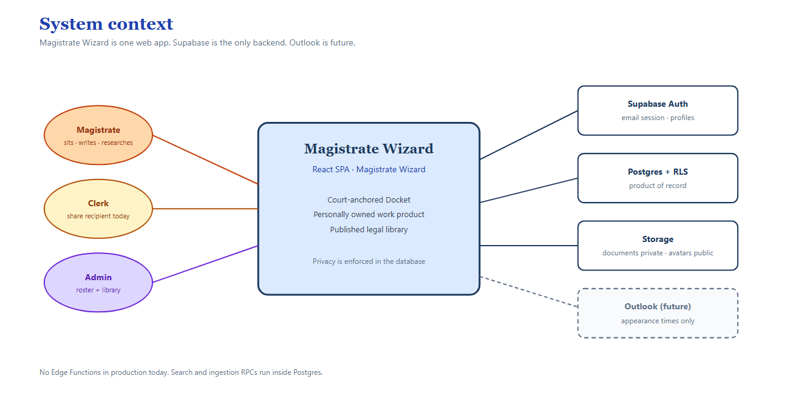
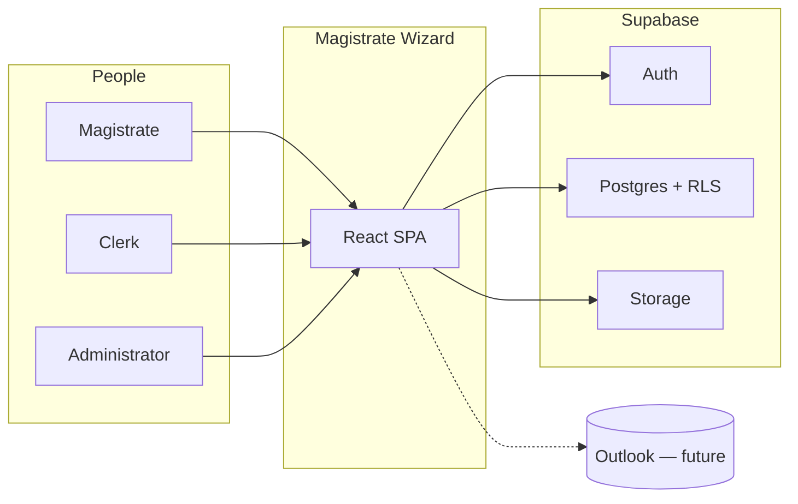

# 1. System context (C4 Level 1)

Magistrate Wizard is a single web application. Magistrates use it to run a Court docket, write judgments, and keep a private research library. Administrators assign magistrates to Courts and curate the shared legal library. Supabase is the only backend: Auth, Postgres with row-level security, and private file storage.

Outlook is a **future** calendar channel. It is not built. Docket Events remain the source of truth for when a matter is listed.

## Plain reading

Think of Magistrate Wizard as a **courthouse filing cabinet with locks on every drawer**.

- The **Docket drawer** is the Court's. Anyone currently assigned to that Court can open it.
- The **Judgment drawer** is the magistrate's own. A colleague can read a judgment only if the author marks it discoverable.
- The **Library drawer** (statutes, canonical case law) is shared. Admins fill it; every magistrate may read published entries.
- Signing up does **not** hand you a Court. An administrator must assign you before you can create Docket Matters.

## What is inside vs outside

| Inside Magistrate Wizard | Outside / future |
|---|---|
| Docket, hearings, parties, shares | Outlook two-way sync |
| Judgments, Quick Codes, Bench Notes | AI extraction |
| Canonical + personal Case Law | Live URL crawlers |
| Legislation reader + ingestion review (including local scanned-PDF OCR) | Cloud document-AI OCR |
| Search (respects the same locks) | Public internet publishing |
