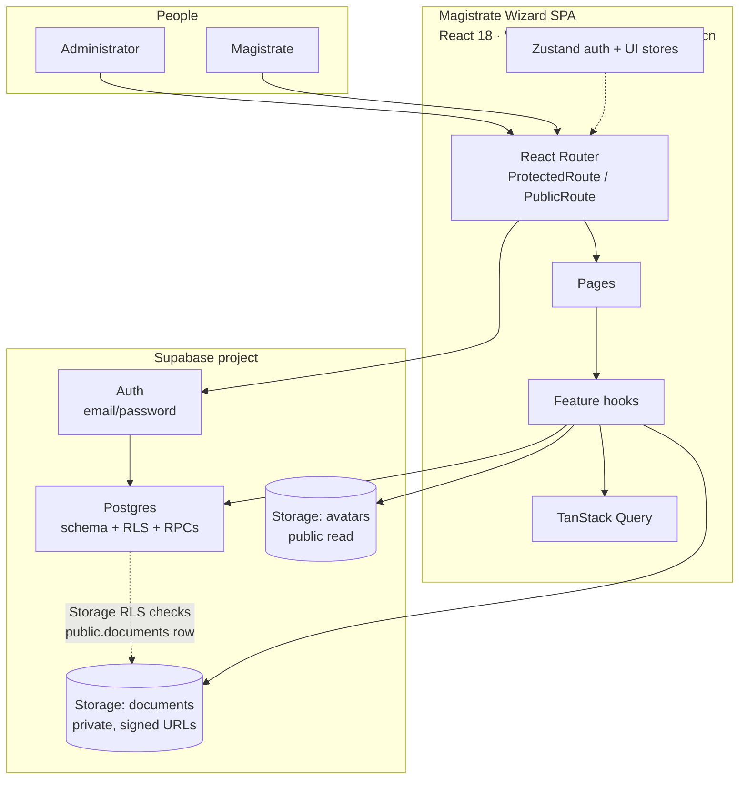
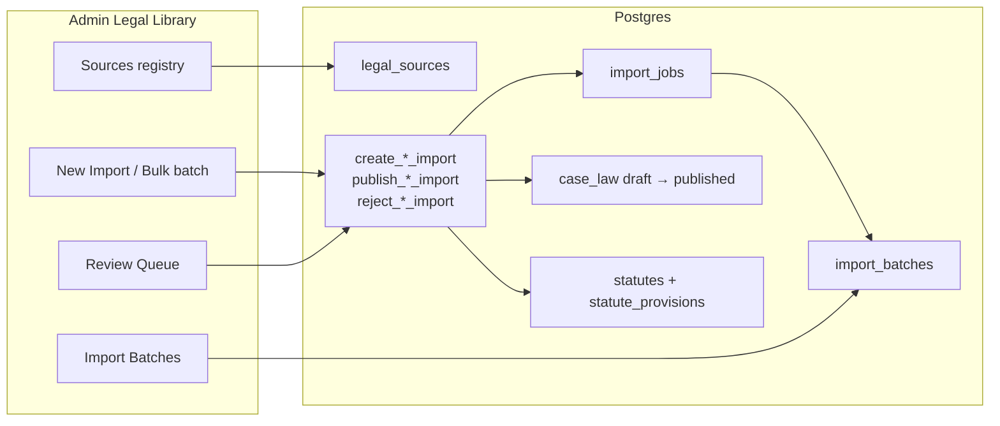

# 2. Containers (C4 Level 2)

One browser app, one Supabase project. There are **no Edge Functions** in production today. Search, access checks, and ingestion RPCs all run inside Postgres.

## Container responsibilities

| Container | Responsibility | Not responsible for |
|---|---|---|
| SPA | Screens, forms, signed-URL display, optimistic UI | Enforcing privacy. RLS is the real lock |
| Auth | Session, signup, password reset | Court assignment. Signup creates a profile with **zero** Courts |
| Postgres | Schema, RLS, triggers, search, ingestion RPCs | File bytes |
| `documents` bucket | PDFs, images, covers, identification photos | Deciding who may read. A matching `documents` row + parent RLS is required |
| `avatars` bucket | Profile pictures | Judicial content |

## Search as a container capability

`global_search(query, limit)` is a `SECURITY INVOKER` SQL function. It unions:

`case` (legacy) · `bench_note` · `statute` · `case_law` · `docket_matter` · `judgment` · `quick_code`

Each branch only returns rows the caller could already `SELECT`. Search cannot leak a private Judgment or another Court's Docket. The Search page groups those seven types in JavaScript; it is not a SQL `GROUP BY`.

`search_statutes` (Legislation list) also matches **provision** body text. `global_search`’s statute branch does **not** — provision-only hits can appear on `/legislation` and miss on `/search`.

## Ingestion machinery (admin only)

`legal_sources` is a **registry of intent**, not a running crawler. URL fetch and AI classification are not built. Scanned-PDF OCR **is** built in the browser (pdf.js rasterize + Tesseract.js, local only).
