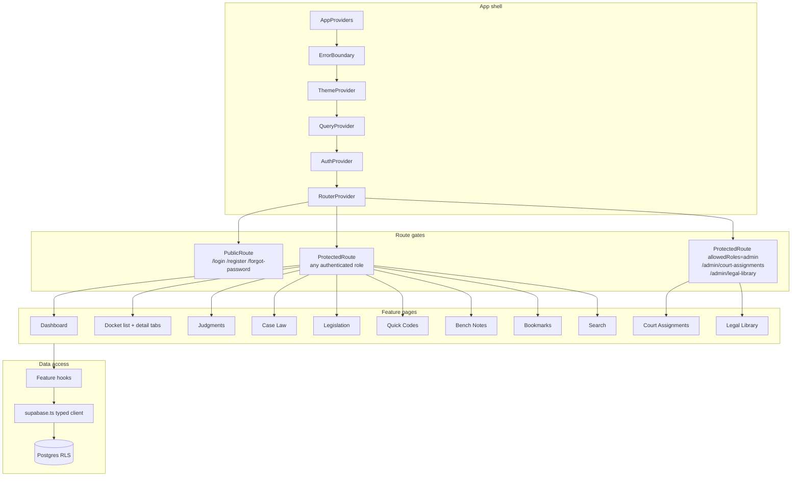
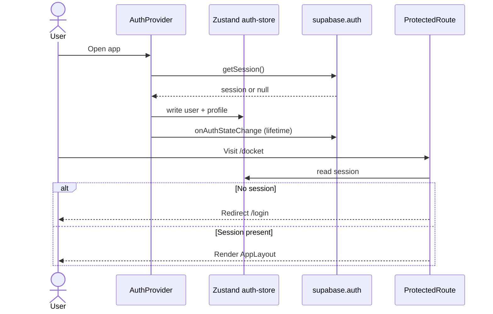
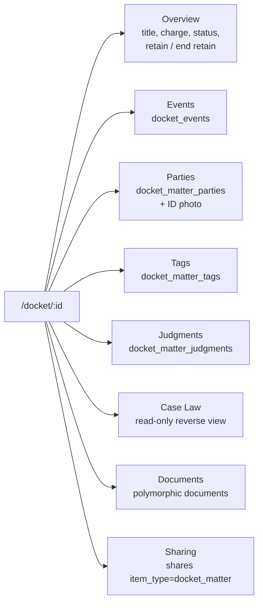

# 3. Application layers (C4 Level 3)

The SPA never invents access rules. Hooks call Supabase; Postgres RLS decides what comes back. Some editors remain clickable for a view-only share; the write still fails.

## Auth flow

`useAuth()` is the only mutation surface for sign-in, sign-up, sign-out, and password reset. Pages do not talk to Auth directly.

## Docket detail — real tabs

The matter page is the operational workspace. Tabs map 1:1 to child tables or association tables.

## Provider / store facts

| Layer | Module | Role |
|---|---|---|
| Composition | `src/providers/app-providers.tsx` | Order: Error → Theme → Query → Tooltip → Auth |
| Session | `src/store/auth-store.ts` | Mirrors Supabase user + profile |
| Chrome | `src/store/ui-store.ts` | Sidebar, mobile nav, command palette |
| Routes | `src/routes/router.tsx` | Admin routes are a separate `allowedRoles={["admin"]}` tree |
| Nav | `src/components/layout/nav-config.ts` | Court Assignments and Legal Library are admin-only items |
