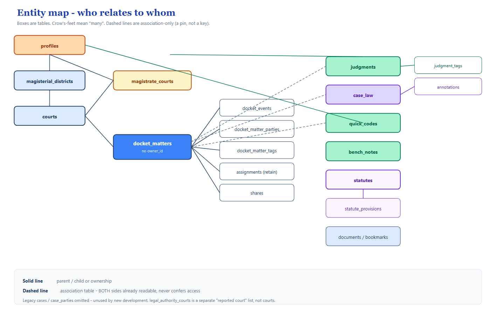
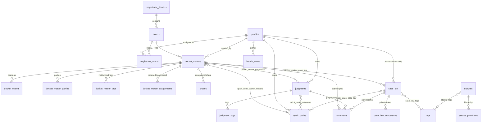
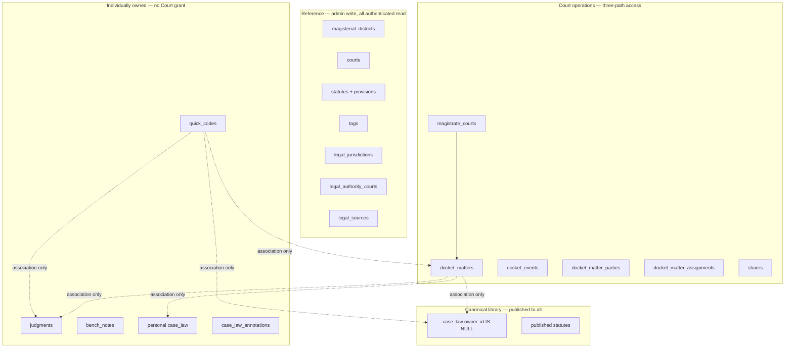

# 4. Complete ERD — overview

High-level map. Detail lives in the next three diagrams. Legacy `cases` / `case_parties` / `case_tags` exist in the database but are **not used** by new development.

## Domain clusters

## Cardinality cheat sheet

| From | To | How |
|---|---|---|
| District | Courts | 1 — many |
| Court | Magistrates | many — many via `magistrate_courts` (time-bounded) |
| Court | Docket Matters | 1 — many |
| Matter | Events / Parties / Tags / Assignments | 1 — many |
| Matter | Judgments | many — many, association only |
| Matter | Case Law | many — many, association only |
| Magistrate | Judgments / Quick Codes / Bench Notes | 1 — many, owned |
| Case Law | Annotations | 1 — many, always private to the annotator |
| Statute | Provisions | 1 — many, self-parented tree |

## Deliberate non-relationships

- `judgments.court_name` is **free text**, not an FK to `courts`. A written judgment may concern a historical or external court.
- `legal_authority_courts` is **not** `courts`. One is the deciding court of a reported case; the other is a physical Guyana Magistrates' Court used for Docket authority.
- `docket_matter_tags` and `judgment_tags` are **not** joins to the global `tags` table. Global tags are readable by everyone; private tag text would leak.
- `profiles.court_id` is **legacy**. Live assignment is `magistrate_courts.ended_at IS NULL`.
