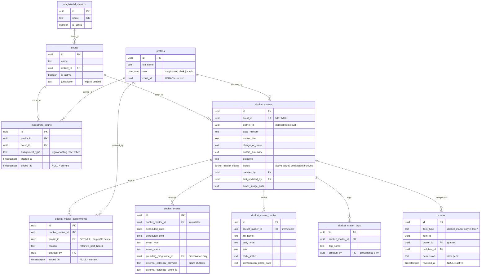
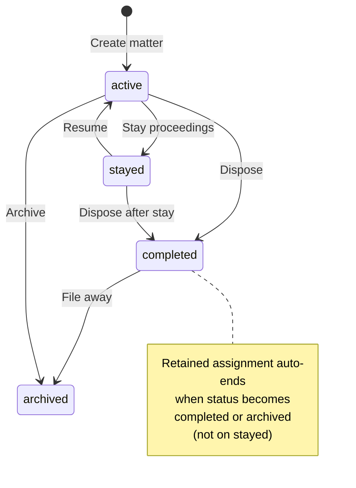

# 5. ERD — Court structure and Docket family

This is the operational heart of Magistrate Wizard. Access is **not** `owner_id`. Access is: current Court assignment **or** retained assignment **or** an active share.

## Constraints that matter

| Rule | Why |
|---|---|
| `UNIQUE (district_id, case_number)` on matters | Case numbers restart per Magisterial District. Not globally unique |
| `UNIQUE (profile_id, court_id) WHERE ended_at IS NULL` | One current assignment per magistrate/court pair. History kept |
| `UNIQUE (docket_matter_id, profile_id) WHERE ended_at IS NULL` | One live retained assignment per person per matter |
| At most one **active** share per recipient per matter | Soft-revoke (`revoked_at`), then create a new row to change permission |
| No `DELETE` policy on matters | Archive via `status`. Judicial history is not erased |
| `district_id` on a matter is trigger-derived | Client cannot pick a district that disagrees with the Court |

## Status of a matter

## Identification imagery (0067)

Cover photos and party identification photos live in the **same private `documents` bucket**. Path columns on the matter/party are denormalized for list rendering. They do not grant access by themselves.

| Column | Table | Purpose |
|---|---|---|
| `cover_image_path` | `docket_matters` | Browse tile / billboard |
| `identification_photo_path` | `docket_matter_parties` | Party photograph |
| `documents.purpose` | `attachment` / `cover` / `identification_photo` | Lets the Documents panel hide ID photos |

## Outlook boundary (not built)

`docket_events` may later store `external_calendar_provider` + `external_calendar_event_id`. Outlook may supply **when and where**. It must never overwrite charge, parties, orders, or outcome.
