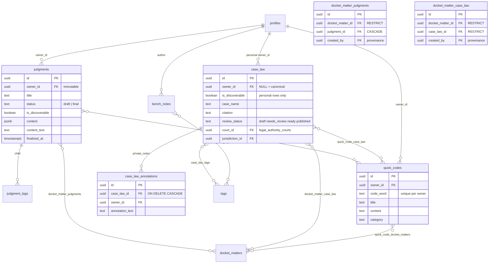
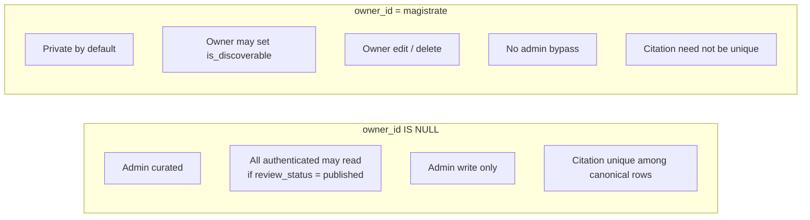
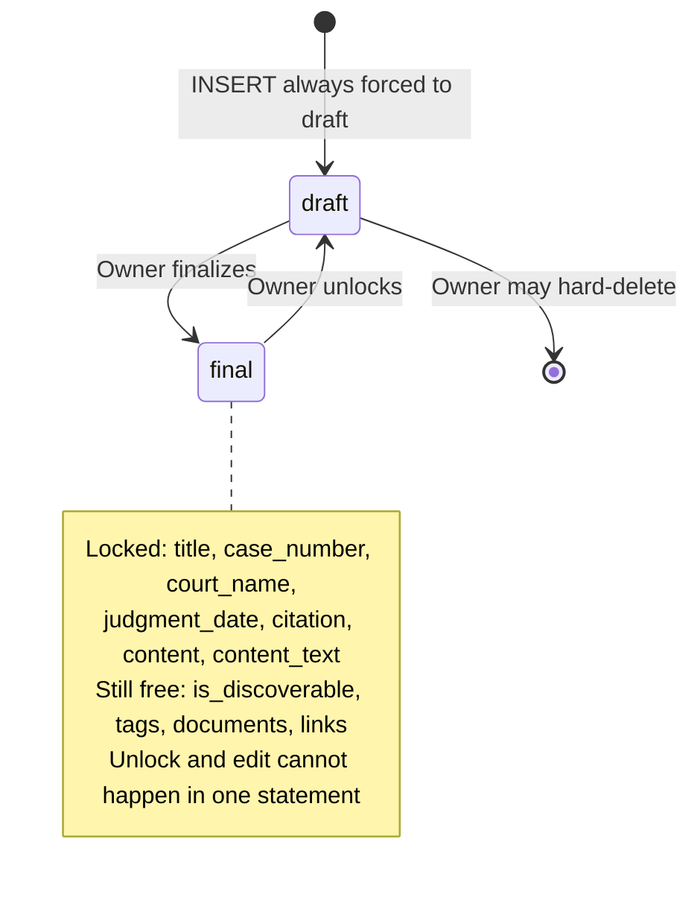
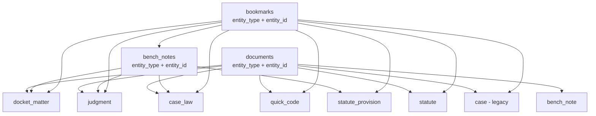

# 6. ERD — Judgments, Case Law, Quick Codes, notes

These records are **not** Court property. Linking them to a Docket Matter never opens the other side.

## Two Case Law worlds in one table

Owning a Case Law record does **not** let you see another magistrate's annotations on it.

## Judgment lifecycle

## Association-table rules (BOTH sides, never OR)

| Join table | SELECT | INSERT / DELETE | Parent delete |
|---|---|---|---|
| `docket_matter_judgments` | Docket access **and** Judgment read | Docket access **and Judgment ownership** | Matter RESTRICT, Judgment CASCADE |
| `docket_matter_case_law` | Docket **and** Case Law read | Docket **and Case Law read** (not ownership) | Both RESTRICT |
| `quick_code_docket_matters` | Quick Code owner **and** Docket | Same. Edit-share on Docket can mutate the link | Quick Code CASCADE, Matter RESTRICT |
| `quick_code_judgments` | Quick Code owner **and** Judgment read | Same | Both CASCADE |
| `quick_code_case_law` | Quick Code owner **and** Case Law read | Same | Quick Code CASCADE, Case Law RESTRICT |

Discoverability of a Judgment can make a Quick Code↔Judgment link appear or disappear **without mutating the join row**.

## Polymorphic attachments

Bookmarks **cannot** target a `document` row. Attachments are bookmarked via their parent. Bench Notes are author-private even when the parent is widely readable.
