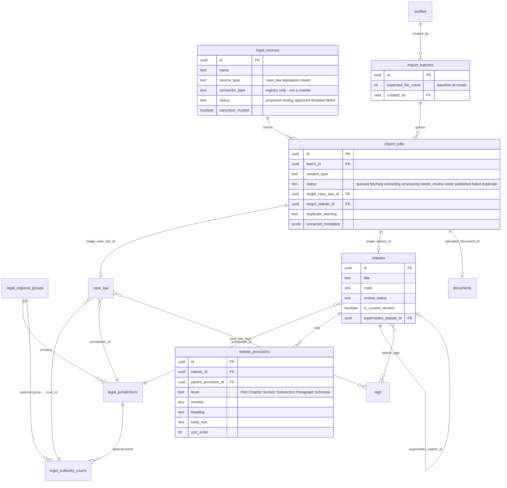
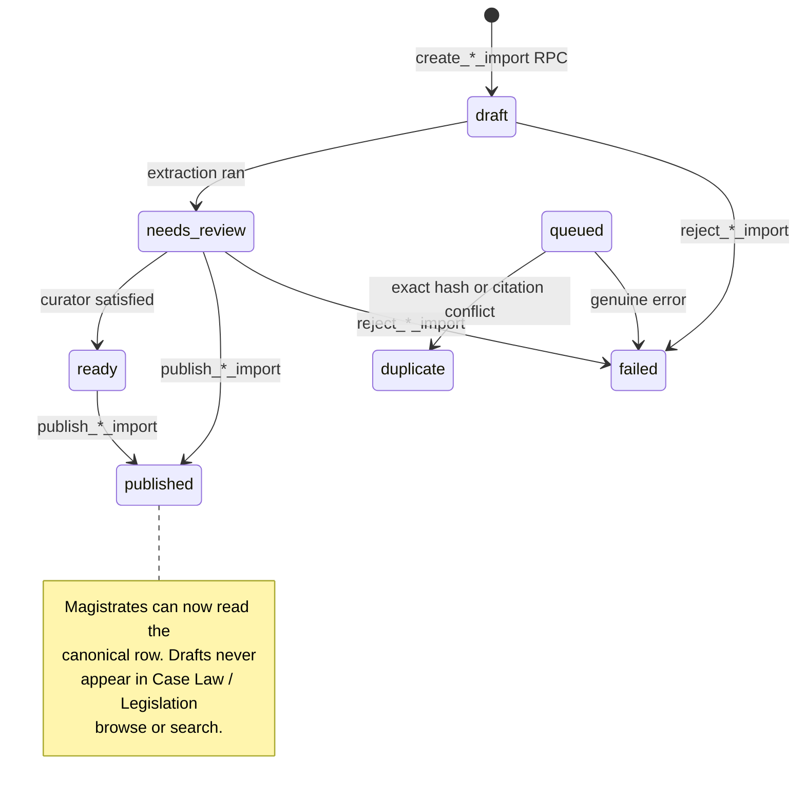
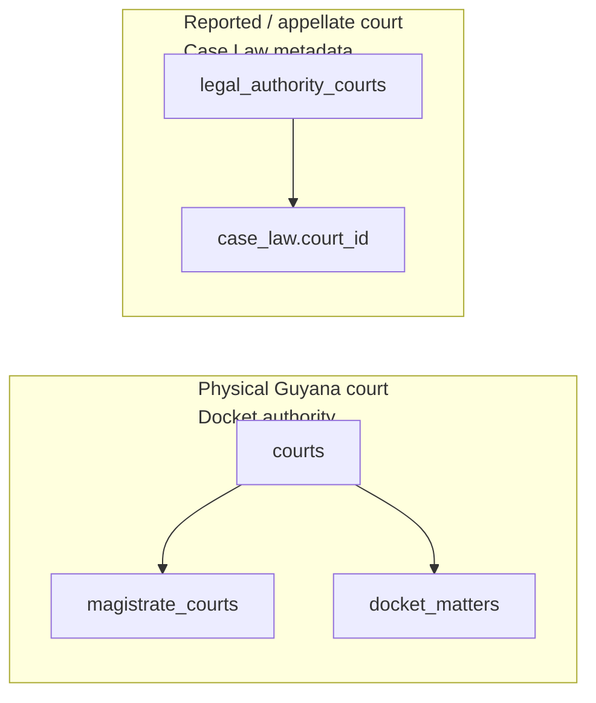

# 7. ERD — Legal library ingestion and legislation

Canonical Case Law and Legislation are **administrative resources**. Drafts are invisible to ordinary magistrates until `review_status = published`.

## Ingestion state machine

## Draft-row-first (why)

A real `case_law` or `statutes` row is created immediately as `review_status = draft`. Publish is a status flip, not a copy. That lets the existing `documents` attachment model parent a file to a real id without a second storage row.

Publish RPCs reject placeholder metadata (for example `"Untitled (pending review)"`) so a record cannot go live empty.

## Duplicate is not failure

Bulk import records every file:

| Outcome | `import_jobs.status` | Row created? |
|---|---|---|
| New draft | `needs_review` / `ready` | Yes |
| Byte-identical file | `duplicate` | No new authority; link to existing |
| Same citation, different file | `duplicate` | File attached to the **existing** Case Law as another source document |
| Validation reject / crash | `failed` | Bare job row so the batch still accounts for the file |

`import_batches.expected_file_count` is stored at create time. A batch is fully accounted when `count(jobs) >= expected_file_count`. Older batches with a null count are labelled **legacy — incomplete history**.

## Two different "courts"

Never join these. "Vigilance Magistrate's Court" is a sitting venue. "Caribbean Court of Justice" is a deciding authority.
