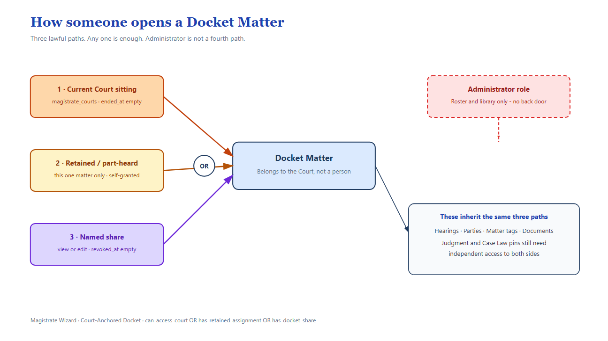
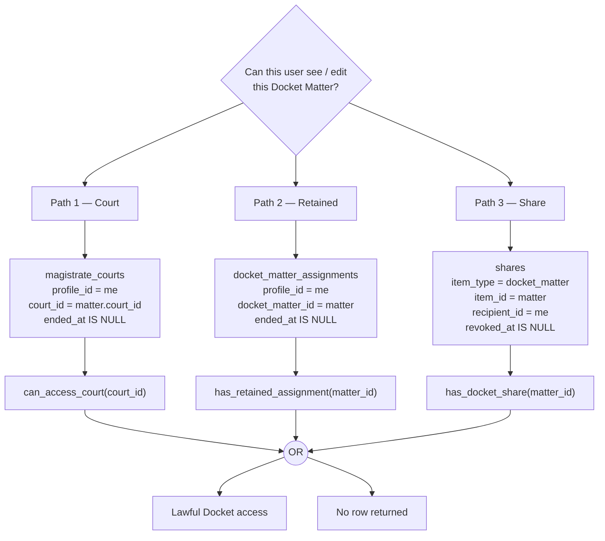
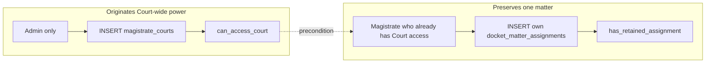
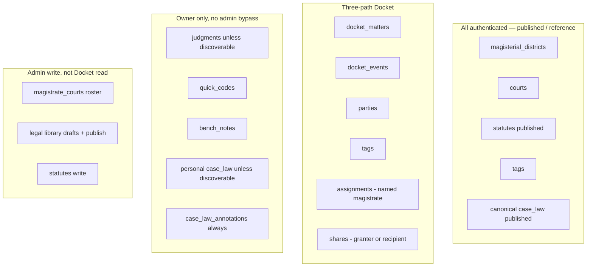
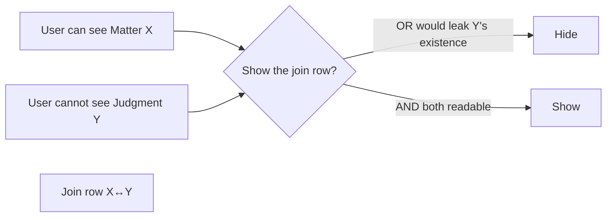

# 8. Access control and privacy

The security boundary is **Postgres RLS**, not the React UI. Some screens still show edit controls to a view-only recipient; the database refuses the write.



## Three paths onto a Docket Matter



`is_admin()` appears on **none** of these paths.

`has_docket_matter_authority()` is **not** a fourth read path. It is Court **or** retained only (never share). It is used to grant/revoke shares and to mutate Judgment / Case Law **links**. Share-only holders can see a matter; they cannot share it onward and cannot pin a Judgment or Case Law card onto it.

View vs edit on a share:

| Permission | Parent matter | Events / parties / tags | Judgment / Case Law **links** | Quick Code ↔ Docket links |
|---|---|---|---|---|
| `view` | SELECT | SELECT | SELECT if BOTH sides already readable | SELECT only |
| `edit` | SELECT + UPDATE | Same mutation rights as a sitting magistrate on those children | SELECT only. INSERT/DELETE need Court or retained (`has_docket_matter_authority`), plus Judgment **ownership** to pin a Judgment | INSERT/DELETE allowed (the Quick Code must still be yours) |

No resharing. Recipient may relinquish. Soft-revoke only. Live `shares.item_type` is **Docket only** (real FK, not a polymorphic uuid).

## Originating authority vs preserving authority



Self-assigning to a Court would let anyone grant themselves an entire docket. Self-retaining a matter you already sit is narrowing, not originating.

## Visibility matrix



| Entity | Default | Share? | Discoverable pool? | Admin bypass? |
|---|---|---|---|---|
| Docket Matter | Court-anchored | Yes, exceptional | **Never** | **No** |
| Retained assignment | Named magistrate | N/A (it is the grant) | No | **No** |
| Judgment | Private | Future (not in 0037) | Yes, read-only | **No** |
| Canonical Case Law | All authenticated (published) | N/A | N/A | Write yes |
| Personal Case Law | Private | Future | Yes, read-only | **No** |
| Annotation | Annotator only | Never | No | **No** |
| Quick Code | Owner only | No | **Never** | **No** |
| Bench Note | Author only | No | No | **No** |
| Documents | Follows parent | Follows parent | Follows parent | SELECT/INSERT follow parent. **DELETE** still allows `is_admin()` (metadata/blob only — not a Docket read bypass) |
| `magistrate_courts` | Self SELECT; Admin write | N/A | N/A | Yes (roster, not content) |

## Association side-channel rule



Always **AND**. Never **OR**.

Link mutation strengths (live SQL):

```
Docket ↔ Judgment:  Court-or-retained  AND  Judgment OWNERSHIP
Docket ↔ Case Law:  Court-or-retained  AND  Case Law READ
Quick Code ↔ Docket: Docket EDIT (edit-share OK)  AND  Quick Code OWNERSHIP
Quick Code ↔ Judgment / Case Law: Quick Code OWNERSHIP  AND  read access to the other side
```

The Quick Code association UI is **read-only today** — the tables and RLS exist; creating/removing those links is not wired in the SPA.

## Roles in the product today

| Role | UI | Database |
|---|---|---|
| `magistrate` | Full workspace | `profiles.role` is **not** consulted by Docket RLS. Authority is assignment / retain / share / ownership |
| `clerk` | Same nav as magistrate. Copy treats clerks as share recipients | **Enum leftover.** No Clerk policies. Identical RLS to a magistrate if they have the same assignment/share/ownership |
| `admin` | Extra: Court Assignments, Legal Library | Roster + canonical library write. **Zero** extra SELECT on Docket / private Judgment / personal Case Law / Quick Codes / Bench Notes |

An administrator who also sits a Court needs a real `magistrate_courts` row, created the same way as anyone else's.

## Profile privacy

`profiles` SELECT is self-only. Display names on retained assignments and shares come from two narrow `SECURITY DEFINER` functions (`0043`), gated by context, never by opening the whole profiles table.
