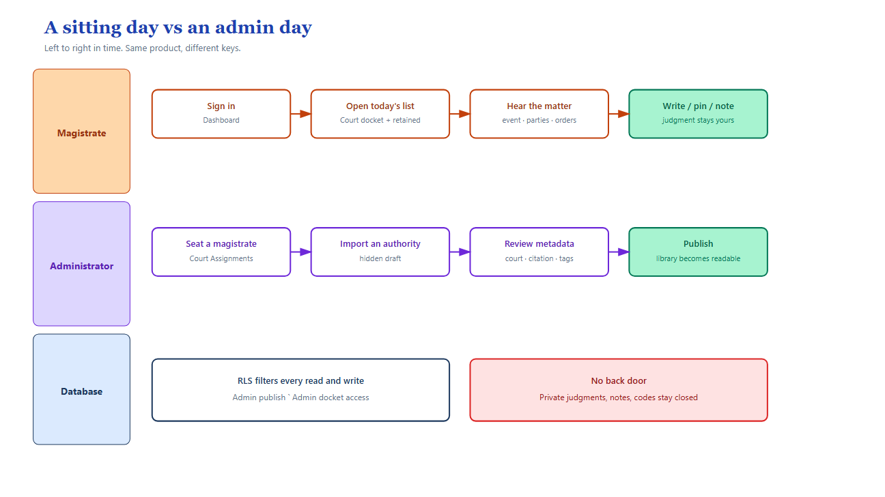
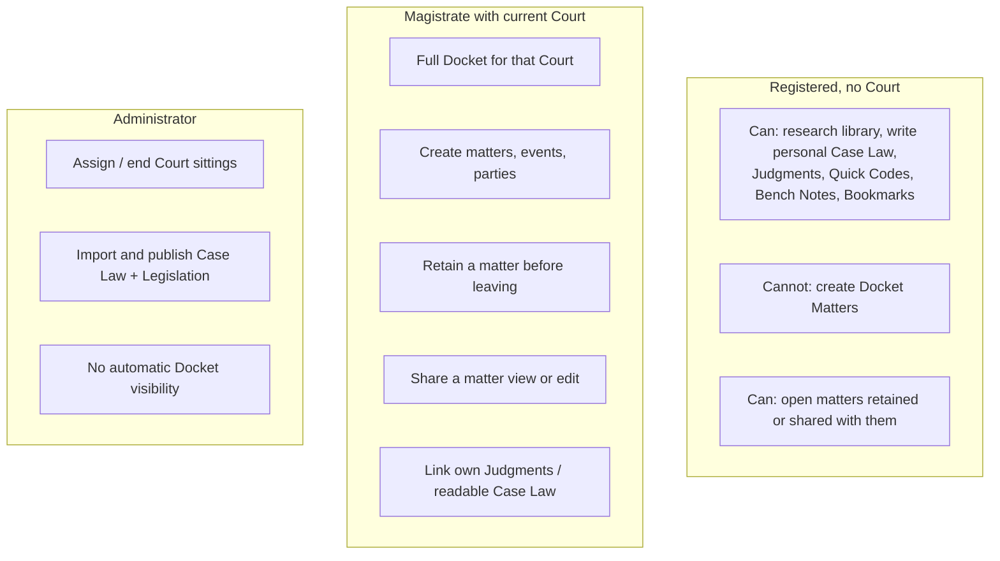
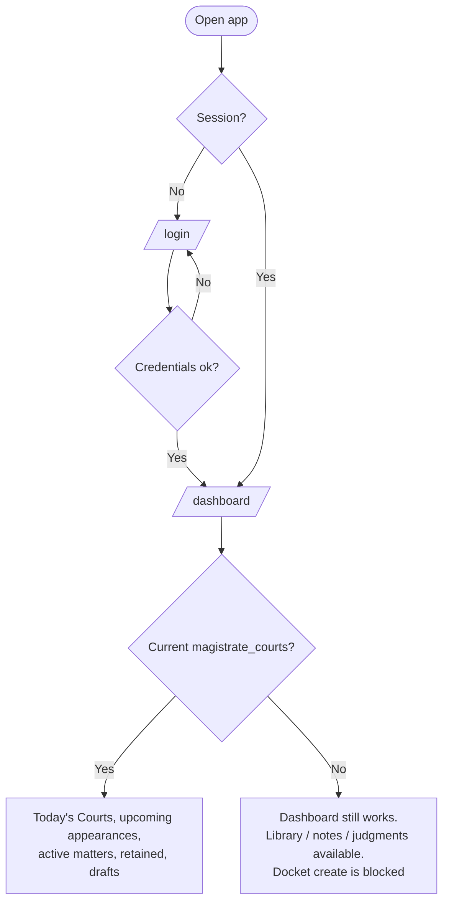
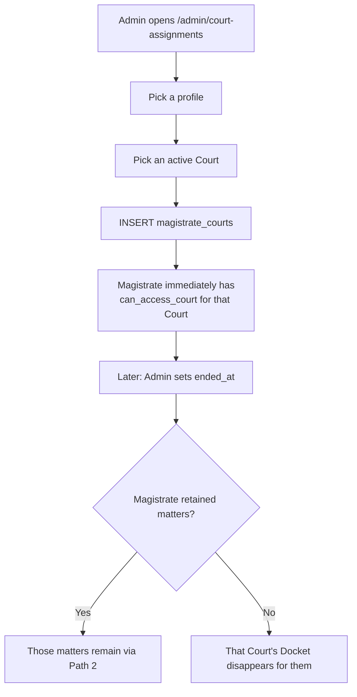
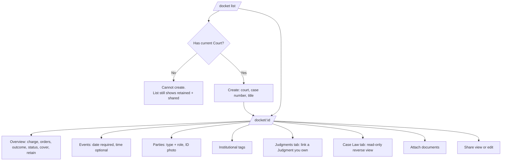
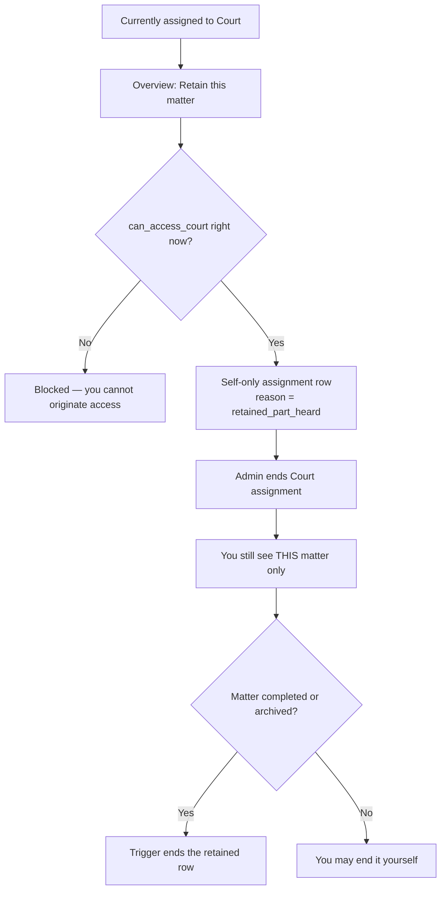
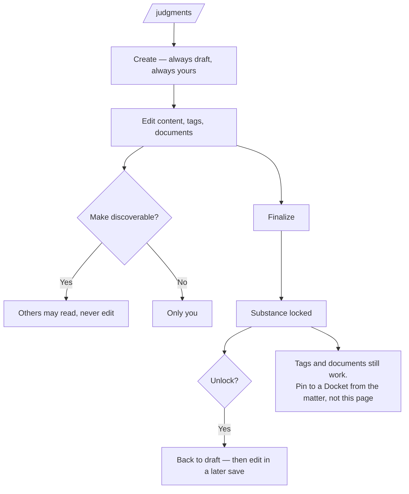
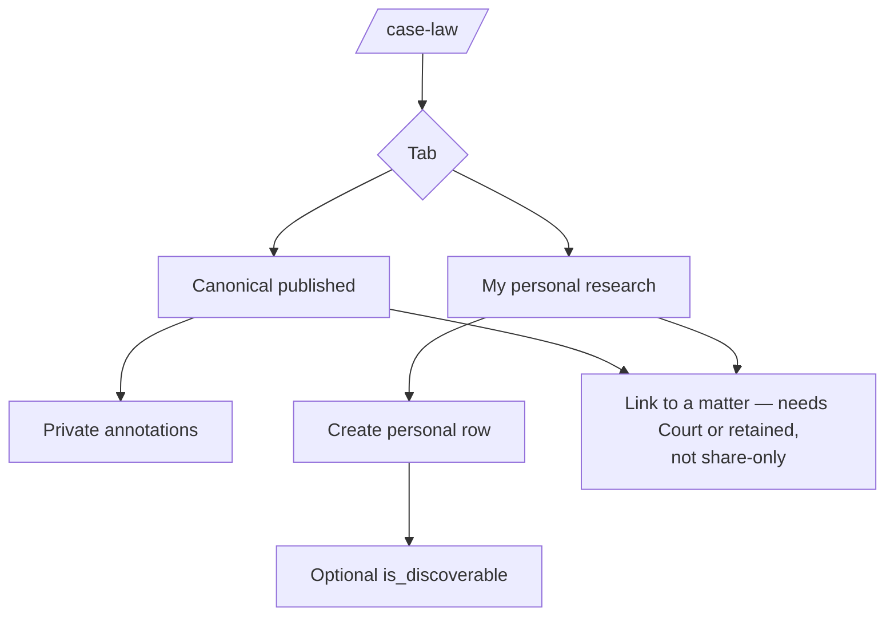
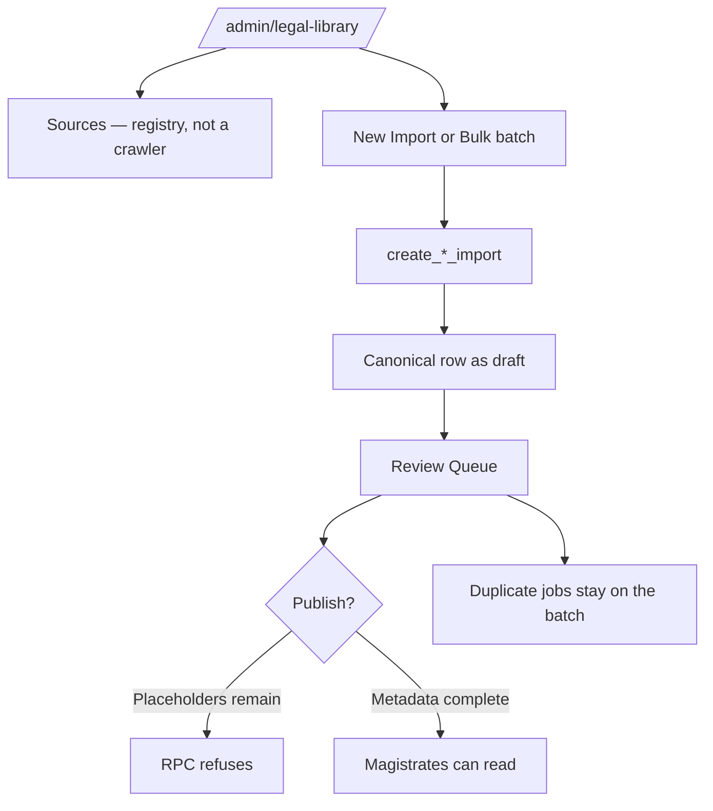

# 9. User journeys

Actors, screens, and blocked paths as implemented in the SPA.

## Personas

## Journey A — First login

Register (`/register`) creates `auth.users` + `profiles`. It does **not** assign a Court.

## Journey B — Sit a Court (admin)

Magistrates cannot insert or end their own Court assignment in V1.

## Journey C — Work a matter (magistrate)

## Journey D — Leave a Court but keep a part-heard matter

A successor assigned to the Court also sees the matter. Retained access is **not exclusive**.

## Journey E — Write and finalize a Judgment

Leaving a Court does **not** transfer Judgments.

## Journey F — Research Case Law

Unpublished library drafts never appear here. Admins review them at `/admin/legal-library`.

## Journey G — Admin legal library

## Journey H — Search and bookmarks

Global search (`/search`) groups **seven** SQL branches in the browser by `entity_type`. Every hit is something the caller could already open. Legacy `case` rows can appear with **no** detail route.

The Legislation **list** search matches provision body text. **Global** search’s statute branch still searches only the Act-level `search_vector` — a phrase that lives only inside a section may miss in `/search` and hit on `/legislation`.

Bookmarkable: Docket Matter, Judgment, Case Law, Quick Code, Bench Note, Statute, Statute Provision, leftover Case. **Not** a raw document file.

## Honest gaps in the live UI

| You might expect | What the SPA actually does |
|---|---|
| View-share disables editors | Controls stay enabled; RLS rejects the write with a toast |
| Link Case Law from the matter tab | Matter tab is read-only. Link from **Case Law** detail |
| Link a Judgment from the Judgment page | Links panel is read-only. Link from the **matter** Judgments tab |
| Type a Quick Code to expand in an editor | **Copy** copies `content` to the clipboard |
| Create Quick Code ↔ matter/judgment/case-law links | Associations dialog is **read-only** |
| New Bench Note on a docket / judgment / case-law page | Create from Bench Notes list, or from a legislation section |
| Password-reset email sets a new password in-app | Link lands on `/login`. No set-password page. Profile / Settings are disabled |
| Clerk-only screens | None. Clerk collapses onto the magistrate RLS envelope |

## Screen map

| Path | Who | Purpose |
|---|---|---|
| `/dashboard` | Any signed-in user | Courts, upcoming appearances, retained, drafts |
| `/docket` | Any | Matters via the three paths |
| `/docket/:id` | Lawful access | Operational workspace |
| `/judgments` | Any | Own + discoverable |
| `/case-law` | Any | Published canonical + own/discoverable personal |
| `/legislation` | Any | Published statutes + provision reader |
| `/quick-codes` | Any | Own snippets only |
| `/bench-notes` | Any | Own notes only |
| `/bookmarks` | Any | Own bookmarks |
| `/search` | Any | RLS-filtered global search |
| `/admin/court-assignments` | Admin UI role | Roster |
| `/admin/legal-library` | Admin UI role | Ingestion + review |
