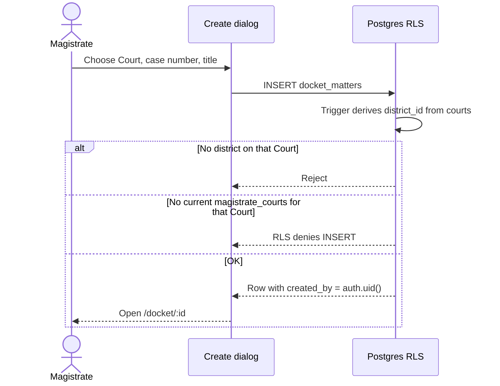
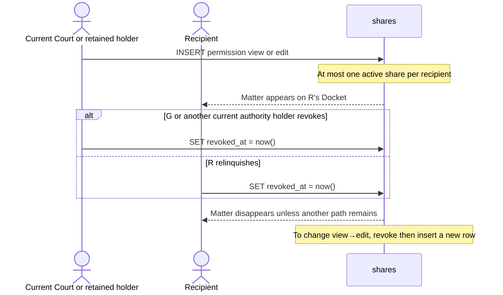
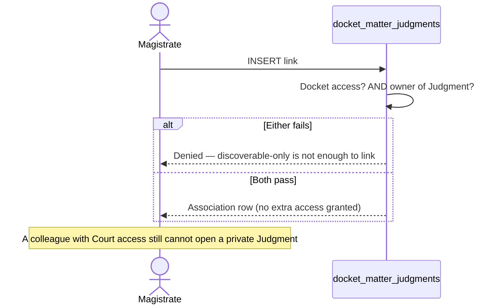
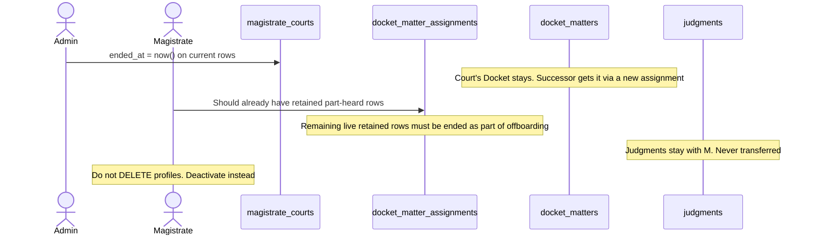
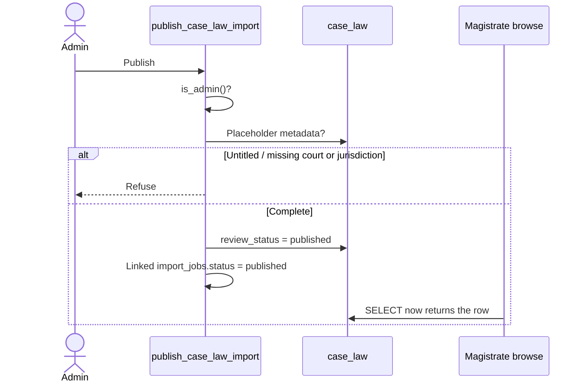
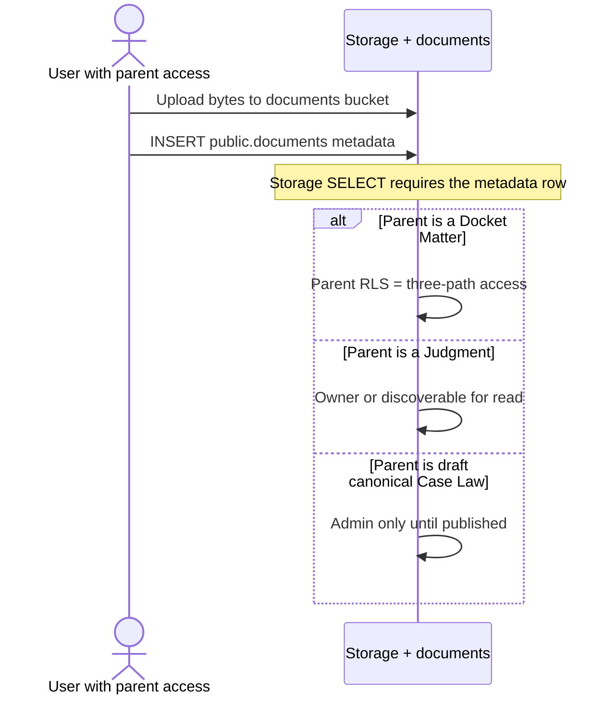

# 10. Sequence and state workflows

Time-ordered views of the rules in [access control](08-access-control.md).

## Create a Docket Matter

## Share, then revoke

## Link a Judgment to a matter

## Offboarding a sitting magistrate

## Publish canonical Case Law

## Quick Codes (as implemented)

Quick Codes are private text snippets (`code_word` unique per owner). The live workspace **Copy** action puts `content` on the clipboard. There is no in-editor expander. Association tables exist; the SPA associations dialog is read-only.

Nobody else ever reads another user's Quick Codes — not even an administrator, and not via a Docket share.

## Document upload

## What is not a workflow yet

| Topic | Status |
|---|---|
| Outlook calendar sync | Columns reserved; no sync |
| Judgment / personal Case Law sharing | Designed in principle; `shares.item_type` is Docket-only in 0037 |
| Clerk-specific permissions | Role exists; no Clerk RLS |
| URL crawlers / AI extract | Not built |
| Scanned-PDF OCR | Built in-browser (Tesseract.js); curator must still verify |
| Password reset completion page | Email currently returns the user to `/login` |
| Profile / Settings | Disabled in the user menu |
| View-share greying out editors | RLS only; controls stay enabled |
