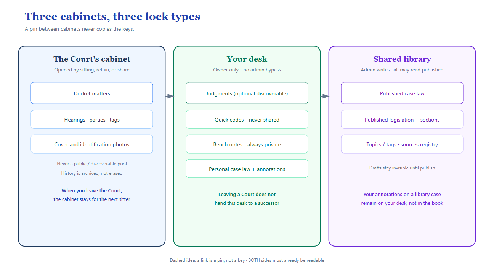
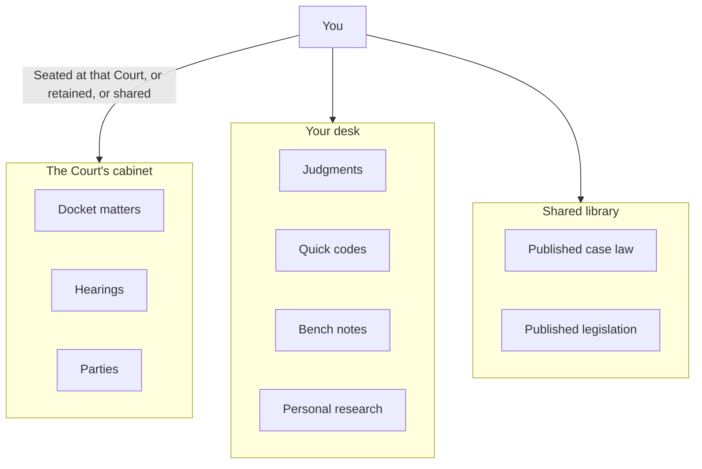

# 0. How to read these guides

## What Magistrate Wizard is

Magistrate Wizard is a computer filing system for magistrates. It holds:

- the **Court's docket** (the list of matters before that Court)
- **your** written work (judgments, research notes, shortcuts)
- a **shared law library** (published case law and legislation)

It is not a public website. Members of the public cannot browse it. Every screen you open has already been filtered so you only see what you are allowed to see.

## Words used here

| Word | Everyday meaning in Magistrate Wizard |
|---|---|
| **Court** | A physical Guyana Magistrates' Court (for example, a sitting at a named location). Not the Caribbean Court of Justice as a reported authority. |
| **District** | The Magisterial District that Court belongs to. Case numbers are unique *inside a district*, not nationwide. |
| **Docket matter** | One case file on that Court's list. Arraignment, maintenance, traffic — all are "matters". |
| **Event** | One listed appearance or hearing date for that matter. |
| **Retained / part-heard** | You kept access to **one** matter after you stopped sitting that Court, so you can finish it. |
| **Share** | You let a *named colleague* see one matter. Exceptional, not the normal way work moves on. |
| **Canonical case law** | An entry in the official library, published by an administrator. Everyone signed in can read it. |
| **Personal case law** | Your own research card. Private unless you mark it discoverable. |
| **Discoverable** | Others may *read*. They still cannot edit. Used for judgments and personal case law — **never** for the docket. |
| **Admin** | Someone who seats magistrates at Courts and publishes the library. Admin is **not** a master key to other people's private writing. |

## A picture of the locks

## What these guides are not

They are not the architecture specification. They do not replace training on the law. They describe **how the software behaves today**.
