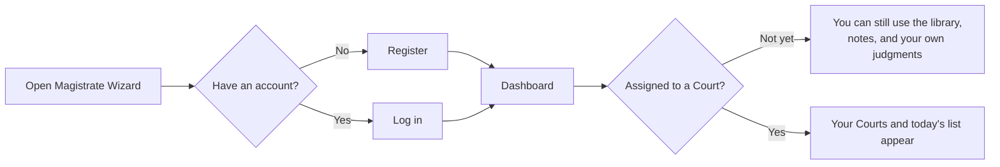

# 1. Getting started

**Who:** anyone with a Magistrate Wizard account  
**Goal:** sign in and understand the home screen  
**Time:** a few minutes

## Steps

1. Open Magistrate Wizard in a browser.
2. If you have no account, use **Register**. You will get a profile. You will **not** yet have a Court.
3. If you forgot the password, use **Forgot password**.
4. After login you land on the **Dashboard**.

## What you will see on the Dashboard

The Dashboard only summarises things you could already open elsewhere. It never shows another Court's secret list.

Typical rows:

- **Your current Courts** — where you are seated right now
- **Upcoming appearances** — hearing dates still marked scheduled
- **Active matters** — docket files in progress
- **Retained / part-heard** — matters you kept after leaving a Court
- **Your draft and final judgments**
- **Your quick codes and bench notes**

## Common surprises

| You expected | What actually happens |
|---|---|
| "I registered, so I should see a docket." | Registration only creates *you*. An administrator must seat you at a Court. |
| "I am an administrator, so I see every docket." | No. Admin tools manage the *roster* and the *library*. To work a docket you still need a real Court assignment, like any magistrate. |
| "Search will find everything in the system." | Search only returns what you are already allowed to open. |

## If something goes wrong

- Wrong password → Forgot password.
- Logged in but sent to **Unauthorized** → you opened an admin page without the admin role.
- Dashboard looks empty → you may be unassigned. You can still open Case Law, Legislation, Judgments, Quick Codes, Bench Notes, Bookmarks, and Search.
