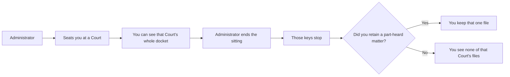

# 2. Court assignment

**Who:** administrator seats; magistrate is seated  
**Goal:** open the Court's docket for a person  
**Everyday analogy:** handing someone the keys to a particular courtroom's filing cabinet

## Why this exists

A docket is **not** "Magistrate X's cases". It is **that Court's cases**. The software therefore asks: *who is currently sitting this Court?*

That answer lives in a dated assignment. While the end date is empty, you have the keys. When an administrator fills the end date, those keys stop working.

## What the administrator does

1. Open **Court Assignments** (admin menu).
2. Choose the magistrate's profile.
3. Choose an **active** Court.
4. Create the assignment.

To move someone to another Court: **end** the current assignment, then create a new one. Do not pretend the old row was always the new Court — history is kept.

To offboard someone: end their Court sittings (and make sure part-heard retains are ended too). Prefer **deactivating** the account later. Do not delete the person if they created docket files — the system needs to remember who did the work.

## What the magistrate cannot do

You cannot seat yourself. You cannot end your own Court sitting. That is deliberate. Anyone who could seat themselves could open any Court's cabinet.

## Assignment types

Regular, acting, relief, or other. They are labels for the roster. **They do not change permissions.** Any current sitting, of any type, opens that Court's docket the same way.

## Dual access is normal

Suppose you retained matter 45 from a Court you left. A new magistrate is now seated there. **Both of you can open matter 45.** You are not the owner. You are finishing a hearing. They are running the Court.

## Related guide

When you are about to leave, read [Sharing and retained matters](05-sharing-and-retained.md) *before* the administrator ends your sitting. You can only retain a matter while you still have the Court keys.
