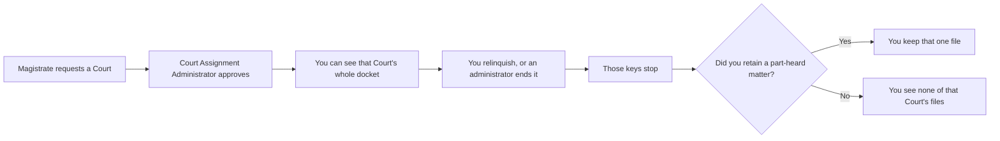

# 2. Court assignment

**Who:** magistrate requests or relinquishes; Court Assignment Administrator approves
**Goal:** open the Court's docket for a person
**Everyday analogy:** handing someone the keys to a particular courtroom's filing cabinet

## Why this exists

A docket is **not** "Magistrate X's cases". It is **that Court's cases**. The software therefore asks: *who is currently sitting this Court?*

That answer lives in a dated assignment. While the end date is empty, you have the keys. When the sitting ends — by the magistrate relinquishing it, or an administrator correcting it — those keys stop working.

## What the magistrate does

1. Open **Court Assignments** and pick a district, then an available Court. Occupied Courts are shown as unavailable — you are never told who holds one, only that it isn't open.
2. Submit the request. It sits **pending** until a Court Assignment Administrator decides it.
3. Until then, that page — request status only — is the only part of the application you can use. Full access to the docket, case law, judgments, and the rest opens the moment your first Court is approved.
4. When you no longer sit a Court, open **Court Assignments** and **relinquish** it yourself. You'll be asked to confirm — this ends your keys to that Court, nothing else. The Court's docket and history stay exactly where they are, waiting for whoever sits there next.

## What the Court Assignment Administrator does

An administrator can still assign or end a sitting directly (a correction, or standing up an **acting**/**relief** sitting) from the same **Court Assignments** screen, and reviews every magistrate's request from its **Pending Requests** tab. Approving one requested Court never approves any other Court the same person also requested — each is decided on its own.

To move someone to another Court: **end** the current assignment, then create or approve a new one. Do not pretend the old row was always the new Court — history is kept.

To offboard someone: end their Court sittings (and make sure part-heard retains are ended too). Prefer **deactivating** the account later. Do not delete the person if they created docket files — the system needs to remember who did the work.

## What nobody can do

Only one magistrate sits a given Court at a time — a second request for an already-occupied Court is refused outright, not queued. Nobody, including a Court Assignment Administrator, can approve their own request as routine business; that is deliberate, so no one can quietly seat themselves. (A documented, audited exception exists for the rare case where exactly one administrator exists at all and there is genuinely no one else to ask — it requires a stated reason and stops working the moment a second administrator exists.)

## Assignment types

Regular, acting, relief, or other. They are labels for the roster. **They do not change permissions.** Any current sitting, of any type, opens that Court's docket the same way. Acting and relief sittings are administrator-only — never requested through ordinary self-service.

## Dual access is normal

Suppose you retained matter 45 from a Court you left. A new magistrate is now seated there. **Both of you can open matter 45.** You are not the owner. You are finishing a hearing. They are running the Court.

## Related guide

When you are about to leave, read [Sharing and retained matters](05-sharing-and-retained.md) *before* you relinquish your sitting. You can only retain a matter while you still have the Court keys.
