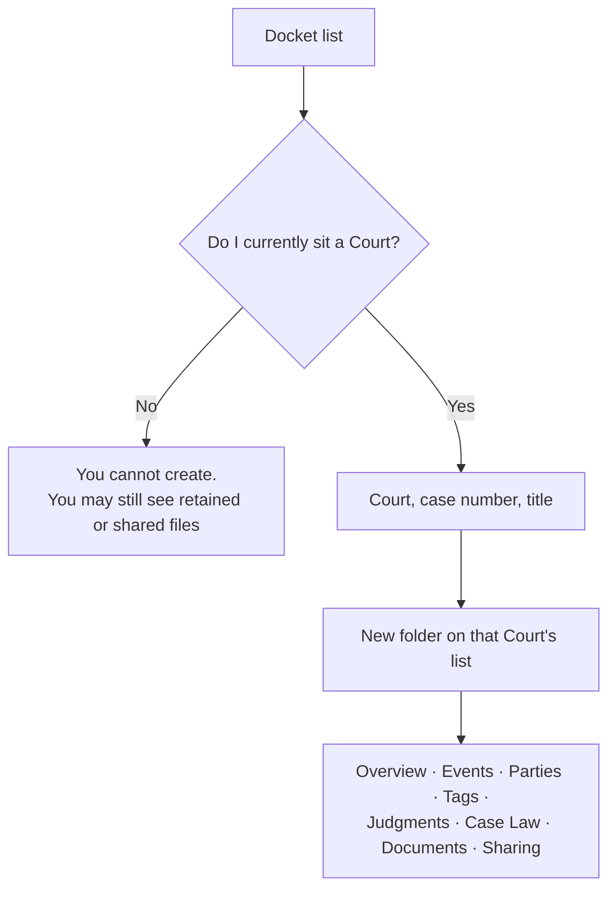

# 3. Working a docket matter

**Who:** a magistrate (or clerk) who can already open that Court's list  
**Goal:** create and run one case file  
**Everyday analogy:** opening a new folder in the Court's cabinet, not in your briefcase

## Create a matter

1. Go to **Docket**.
2. Start a new matter.
3. Pick a Court you **currently sit**.
4. Enter the official **case number** and a short **title** (the names you would read out).
5. Save.

The district is filled in from the Court. You do not choose it. Case numbers must be unique **inside that district**, not worldwide — two districts may both have "45/2024".

## The matter page

| Tab | What it is for |
|---|---|
| Overview | Charge or issue, rolling orders, overall outcome, status, cover image, retain |
| Events | Each listed date |
| Parties | People and roles, optional identification photo |
| Tags | Court-visible labels such as "urgent" (not your private sticky notes) |
| Judgments | Pin *your* written rulings to this file |
| Case Law | Pin authorities you can read |
| Documents | PDFs and other attachments |
| Sharing | Let one named colleague in |

You can bookmark the matter from the header.

## Status

- **Active** — live
- **Stayed** — paused; a retained magistrate still keeps it
- **Completed** — finished; any retain ends automatically
- **Archived** — filed away; retain also ends

There is no "delete this case from history" button. That is the point of a court record.

## Cover image

A cover photo (often a party's identification picture reused) appears on tiles and the top of the page. It is stored as a private file. Anyone who can already open the matter can see it.

## If create is blocked

You are not currently assigned to the Court you picked. Ask an administrator to seat you, or work from a matter that was retained or shared with you.

## What this file is not

It is not your personal notebook. Colleagues who later sit the same Court will see it. Put private thinking in **Bench Notes** or **personal Case Law**, not in the matter's institutional tags.
