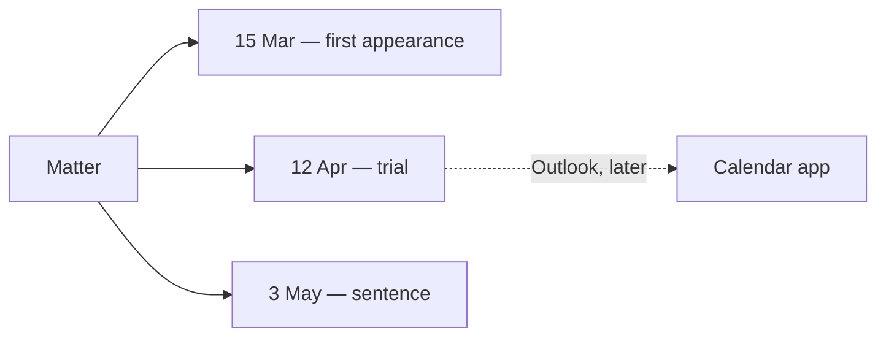

# 4. Hearings, parties, and documents

**Who:** anyone with edit access to the matter (Court sitting, retain, or an **edit** share)  
**Goal:** record who appeared, when they must return, and what was filed

## Hearings (Events)

A matter lasts. Hearings stack up: first appearance, adjournment, trial, review.

1. Open the matter → **Events**.
2. Add an event.
3. **Date is required.** Time may wait until the list is settled.
4. Optionally note type, stage, what was ordered *that day*, and free notes.

"Next appearance" is not a separate field. The system looks at the dated events. If you reschedule, change the event — do not keep a stale "next date" on the folder cover.

Outlook, when it arrives, may copy **dates**. It will not be allowed to rewrite the charge or the orders.

The name of who presided is recorded as history. It is not a permission. Sitting the Court is what grants permission.

## Parties

1. Open **Parties**.
2. Add a name, a **party type**, and a **role** (they are different vocabularies — type is who they are in the proceeding; role is the part they play).
3. Names are not unique. Two "John Singh" rows are allowed; people are not identifiers.
4. Do not "delete" a party to rewrite history. Status is used instead.
5. You may attach an **identification photograph**. It can be shown on the party list and reused as the matter cover.

Contact details stay in the form — they are not splashed on the list the way a photo may be.

## Documents

Attachments follow the **folder they hang on**:

- On a matter → anyone with that matter
- On your judgment → you (and readers if you made it discoverable)
- On library case law → follows whether that entry is published / yours / discoverable

Upload PDFs, images, Word, Markdown, or text files into the private documents store. The app then shows a time-limited view. There is no public download page.

Identification photos and covers are documents too, marked so they do not clutter the ordinary attachments list.

## Tags on a matter

Matter tags are **institutional**. The next magistrate at that Court will see "urgent". They are not your private "read on Friday" label. Private labels are a future feature and must not piggy-back on these tags.
