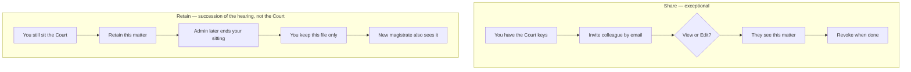

# 5. Sharing and retained matters

Two different kindnesses. Do not mix them up.

| | **Share** | **Retain (part-heard)** |
|---|---|---|
| When | A colleague needs this *one* file for a short consultation | You are leaving the Court but this matter is still yours to finish |
| Who grants it | Anyone who already has Court or retained access | Only **you**, and only **for yourself**, while you still sit the Court |
| How wide | One named person | One named person — you |
| How it ends | Revoke, or they give it back | You end it, or completing/archiving the matter ends it |
| Typical story | "Please look at this maintenance file with me." | "I started the trial; I will finish it after I move." |

## How to share

1. Open the matter → **Sharing**.
2. Enter the colleague's **exact account email**.
3. Choose **view** (read) or **edit** (they may update the file the way a sitting magistrate would, with the limits described below).
4. They cannot pass the share on.
5. To change view into edit: revoke, then share again. The old row stays as history.

If the page says you cannot share, you only have a *view* share yourself, or you no longer have Court/retained authority.

**View** lets them read the matter, events, parties, and tags. It does not let them pin a Judgment or Case Law card. **Edit** lets them change the file, but still does not open a Judgment they do not own, and still cannot pin Judgment or Case Law (that needs Court or retained keys).

The Sharing screen may still *show* Save buttons to a view-only colleague. If they try, the save fails. The lock is in the database, not a greyed-out form.

## How to retain

1. While you **still sit** the Court, open Overview.
2. Choose **Retain this matter**.
3. You cannot retain a file for someone else. You cannot retain a file at a Court you do not currently sit.

After your sitting ends, the matter stays on your Dashboard under **Retained / Part-Heard**. When the matter is completed or archived, the retain ends by itself. A stay does **not** end it — a paused trial may resume in your hands.

## Offboarding

Before a magistrate leaves office:

1. They retain any part-heard files *first*.
2. Administrator ends Court sittings.
3. Remaining live retains are ended when the work is truly handed on.
4. Keep the person's name in the system. Deleting the profile is an emergency, not a retirement party.

## Related

Court keys: [Court assignment](02-court-assignment.md).
