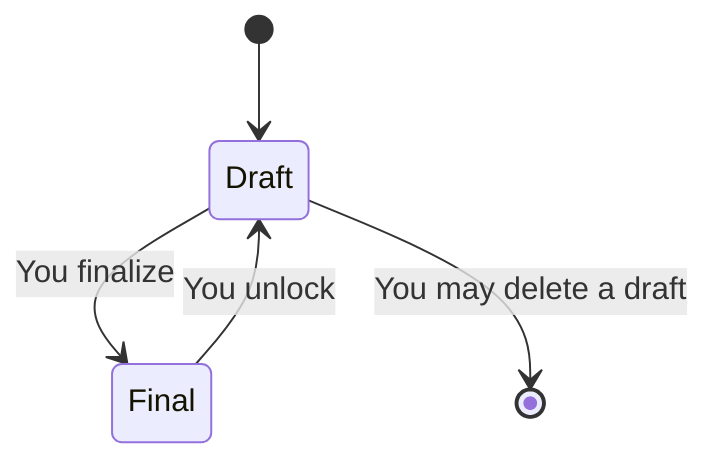

# 6. Writing a judgment

**Who:** you, the author  
**Goal:** draft, lock, and optionally let colleagues read  
**Everyday analogy:** the opinion is in *your* bound volume. The docket folder may point to it. Pointing is not photocopying.

## Create

1. Open **Judgments**.
2. Create a new one. It always starts as **draft** and always belongs to you. You cannot create one in a colleague's name.

Fill title, optional case number, court name (plain words — it does not have to be a Court on the roster), date, citation, and the text.

## Finalize

Finalizing **locks the words**: title, numbers, dates, citation, body. You can still:

- toggle **discoverable**
- add tags
- attach files

Pin the judgment onto a matter from the matter’s **Judgments** tab (not from this page). Quick Code associations are not editable in the screens yet.

You cannot delete a final judgment until you unlock it back to draft. Unlock first, edit in a **separate** save. The system will refuse a single save that both unlocks and rewrites the text — that would be a back door.

## Discoverable

Off (default): only you.  
On: every signed-in magistrate may **read**. They still cannot edit, delete, or take it over.

This is *not* making it canonical case law. It is not publishing to the world. It is "colleagues may look this up".

## Link to a docket matter

From the matter's **Judgments** tab, pin a judgment **you own**. Being able to read a colleague's discoverable judgment is not enough to pin it.

A magistrate who later sits that Court will see the matter. They will **not** automatically see your private judgment. The pin does not hand them the volume.

## Leaving a Court

Your judgments stay yours. The new magistrate gets the docket, not your prose.

## Administrator

Admin cannot open your private judgment. There is no "break glass" button for judicial writing.
