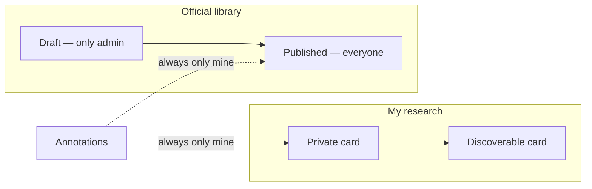

# 7. Researching case law

**Who:** every signed-in user for the published library; you for your private cards  
**Goal:** find authorities, keep personal notes, pin them onto a matter

## Two kinds of card, one list

| Kind | Who writes it | Who reads it |
|---|---|---|
| **Library (canonical)** | Administrator, after review | Everyone, once **published** |
| **Personal** | You | You, unless you mark it discoverable |

They live in the same **Case Law** area so a search can return both. They are not two different apps.

## Browse published law

Open **Case Law**. Use the canonical tab. You may filter by jurisdiction and deciding court (the *reported* court — CCJ, a High Court, and so on — not the Magistrates' Court you sit).

Unpublished imports never appear here. That is how the library stays clean.

## Your own cards

Create a personal entry for a decision you are studying. Citation need not be unique — two magistrates may both note the same case.

Mark discoverable only if you want colleagues to read the card. They still will not see your **annotations**.

## Annotations

Pin a passage and a note. Multiple notes per case are fine. The person who owns the library entry (even an admin) cannot see *your* notes on it. If the parent card later becomes unreadable to you, your notes hide until you can read the parent again. They are not deleted.

## Pin onto a docket matter

Open the Case Law card → **Link to a Docket Matter**. Pick a matter you sit or have retained. A share-only copy of a file is not enough to create the pin — the save will fail.

The matter’s **Case Law** tab is a reverse view of pins already made. You do not create the link from there.

You do **not** need to “own” a library case to cite it — citing is what the library is for. Citing does not grant the next magistrate your private annotations.

## What is not here yet

Sharing a personal card with one named colleague (the way docket shares work) is not built. Outlook does not ingest authorities. The library is not a web crawler — see the admin guide.
