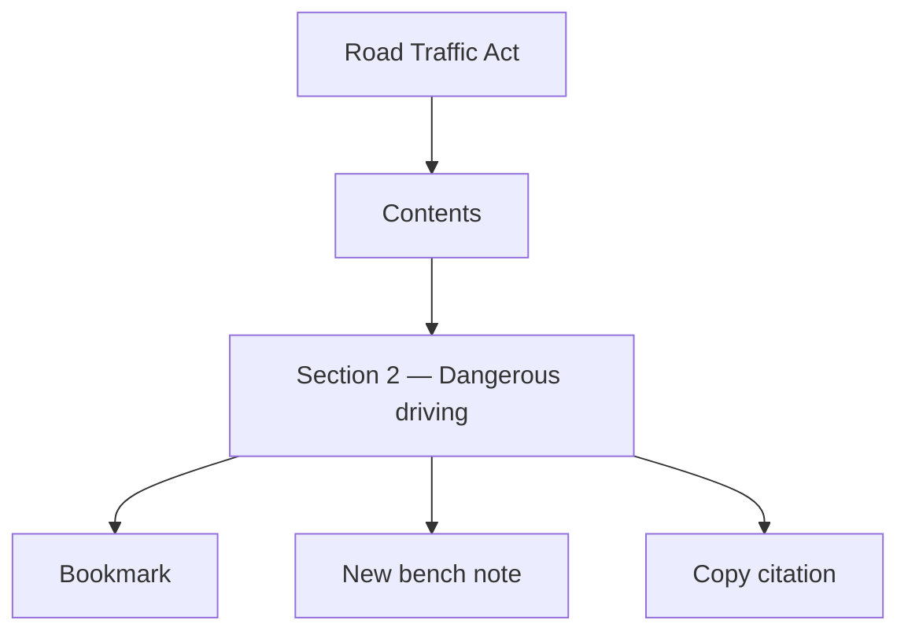
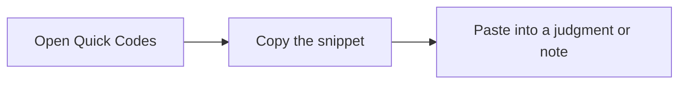

# 8. Legislation, bench notes, and quick codes

## Legislation

**Legislation** is the published statute book.

1. Open the list. Only **published** Acts appear.
2. Open an Act. If it has been broken into parts and sections, you get a table of contents and a reader.
3. A section has a stable link (`/legislation/.../section/...`). Bookmark that section, copy its text, copy a short citation, or start a **bench note** locked to that section.

If an Act has no structured sections yet, you see the older whole-text view. Nothing is broken.

Draft Acts in the admin import queue are invisible here, same rule as unpublished case law.

## Bench notes

A bench note is a **private working note**. Only you see it, even if it is "about" a docket matter or a statute section everyone can read.

Create from **Bench Notes** (pick a parent: matter, judgment, case law, or Act), or from a legislation **section** (the parent is then locked to that section). There is no “New Bench Note” button on a docket, judgment, or case-law page today.

This is the right place for "ask clerk about service" — not the Court's institutional matter tag.

## Quick codes

Quick codes are **your** text shortcuts. Example: a standard adjournment formula stored under a short code word.

- Unique per person. Two magistrates may both use `adj`.
- Nobody else can see them. Not the administrator. Not a colleague you shared a docket with.
- **Copy** puts the snippet on the clipboard. There is no in-editor “type `adj` and it expands” yet.
- Existing links to matters, judgments, or case law can be *viewed*. Creating or removing those links is not in the screens yet.

## Bookmarks vs notes vs codes

| Tool | Purpose |
|---|---|
| Bookmark | "I want to find this again." |
| Bench note | "I want to write about this, privately." |
| Quick code | "I want to reuse a paragraph of my own." |
