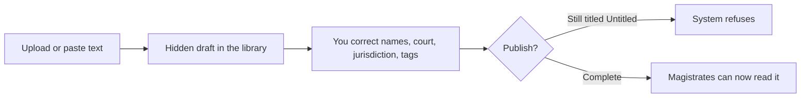

# 9. Admin: roster and library

**Who:** users with the administrator role  
**Goal:** seat magistrates, and publish clean law into the shared library  
**What this is not:** a window into other magistrates' private judgments, notes, or snippets

## Court Assignments

Covered in [Court assignment](02-court-assignment.md). Recap:

- A magistrate requests a Court and relinquishes their own sitting; only a Court Assignment Administrator approves a request, and nobody approves their own.
- Admin can still create or end a sitting directly for a correction, or to stand up an acting/relief sitting.
- Ending a sitting does not delete the Court's files.
- Admin still needs their *own* sitting to work a docket.

## Legal Library workspace

Open **Legal Library**. Typical tabs:

1. **Sources** — a register of places law *might* come from. Saving a source does **not** download anything. Official index harvest (MoLA / Parliament / CCJ) is a local script, not an in-app crawler — see [Official Legal Library seeding](../legal-library-official-seeding.md).
2. **New Import** — one document at a time.
3. **Review Queue** — drafts waiting for a human.
4. **Batches** — bulk import history. Every file should leave a trail, including duplicates.

## Honest limits (do not over-claim to users)

| Feature | Today |
|---|---|
| `.txt` / Markdown auto-read | Yes |
| PDF / Word text | Text-layer PDFs extracted automatically; scanned PDFs and images recognized locally; `.docx` extracted in the browser. Word 97–2003 (`.doc`) still needs paste or a `.docx` copy |
| Fetch from a URL | Not built |
| OCR of scans | Built in the browser: scanned PDFs and images are recognized locally with Tesseract. Always verify the text before publishing |
| In-app preview | PDFs, images, text, Markdown, and `.docx` can be opened in the documents viewer. `.doc` is download-only |
| AI classifying issues | Not built — keyword suggestions only |
| Duplicate file | Recorded as **duplicate**, not as a failure |
| Same citation, different scan | Attached to the *existing* case as another source file |

## Publish checklist (Case Law)

The system will refuse to publish placeholder shells. You need a real name, citation, jurisdiction, and deciding court — not "Untitled (pending review)".

Legislation needs a real title, code, and jurisdiction.

## Drafts stay invisible

A magistrate searching Case Law during your review will not stumble on a half-imported fixture. That is intentional.

## Tags

Proposed tags are suggestions. Nothing is applied until you save tags on the review card. Matching is by name so "Hearsay" and "hearsay" do not become two topics.

## Two "courts" again

When you set **deciding court** on a case, you are picking from the *reported authorities* list (CCJ, High Court, …). You are not picking a Magistrates' Court from the docket roster.
