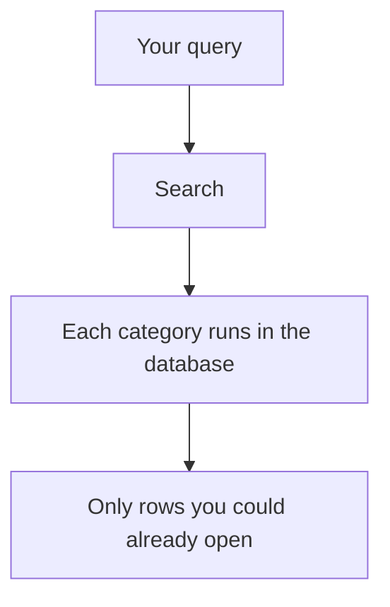

# 10. Search and bookmarks

## Search

Open **Search** and type as you would in a library catalogue.

Results are grouped. Typical groups:

- Docket matters
- Judgments
- Case law
- Legislation (the Act title and summary). A phrase that lives **only** inside a section is more reliably found on the Legislation list page than here.
- Quick codes (yours only)
- Bench notes (yours only)
- Legacy "cases" (old table; not used for new work)

Search cannot be used as a peephole. If a judgment is private, it will not appear for anyone but its author. If a docket is another Court's, it will not appear unless you retained it or it was shared with you. Unpublished library drafts do not appear.

## Bookmarks

Star a record from its page. Open **Bookmarks** to return later.

You can bookmark:

- a docket matter
- a judgment
- a case law card
- a quick code
- a bench note
- an Act
- a **section** of an Act
- a leftover legacy case

You cannot bookmark a raw uploaded PDF as its own thing. Bookmark the matter or judgment it is attached to.

## Dashboard as a shortcut

The Dashboard is a thin "today" view of the same locks: your Courts, coming dates, retained files, your drafts. If it is empty, you are probably not seated yet — you can still search the published library and your own notes.

## If you cannot find something

1. Confirm you are allowed to open it (wrong Court? private judgment? unpublished draft?).
2. Try the specialised list page (Docket, Judgments, Case Law) with its own filters.
3. For a section’s wording, search from **Legislation**, not only the global search box.
